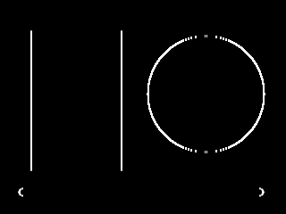
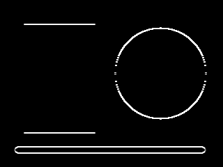

# Deep Learning Homework 2

# CS5720 Neural Network and Deep Learning - HW1

## Student Name : Subarna Gaine
## Email: sxg14510@ucmo.edu
## UCM Student ID: 700791451

## Question 1: RNN Text Generation

This question implements a character-level Recurrent Neural Network (RNN) for text generation. The model use a Long Short-Term Memory (LSTM) layer to learn which character is likely to come next in a text dataset.

### What the solution does

1. Downlaods the Tiny Shakespeare dataset from GitHub.
2. Uses a short backup Shakespeare text if the download is unavailable.
3. Converts every caracter into an integer ID.
4. Creates training examples from sequences of characters and the next character.
5. Uses an embedding layer to convert character IDs into learned numerical vectors.
6. Uses an LSTM layer to learn patterns in the character sequence.
7. Uses a dense output layer to predicts the next character.
8. Generates text one character at a time from a starting prompt.

The implementation is in [Q1_Implement_RNN_For_Text_Generation.py](Q1_Implement_RNN_For_Text_Generation.py).

### Model structure

- Embedding layer: 64-dimensional character representations
- LSTM layer: 128 hidden units
- Dense layer: one output score for each uniqe character
- Loss function: sparse categorical cross-entropy
- Optimizer: Adam

### Temperature scaling

During generation, the model produces a score for every possible next character. These scores are converted into probabilities using softmax. Temperature change the sharpness of this probability distribution:

- Lower temperature, such as `0.3`, produces safer and more predictable text.
- Higher temperature, such as `1.0`, produces more varied and random text.
- A temperature around `0.7` gives a balance between consistency and randomness.

The script samples from the probability distribution instead of always select only the highest-scoring character.

## How to execute Question 1

### Requirements

The script requires Python 3 and TensorFlow. The included shell script checks whether TensorFlow is installed and attempts to install it if necessary.

From this directory, make the launcher executable once if needed:

```bash
chmod +x run_Q1_Implement_RNN_For_Text_Generation.sh
```

Run the Question 1 solution with the reduced dataset used for this experiment:

```bash
./run_Q1_Implement_RNN_For_Text_Generation.sh --max-characters 100000 --epochs 3 --temperature 0.7
```

The launcher runs training in the background. It writes the output to:

```text
q1_rnn_text_generation_run.log
```

To watch the output while training is running:

```bash
tail -f q1_rnn_text_generation_run.log
```

The process ID are stored in `q1_rnn_text_generation.pid`. To stop training:

```bash
kill $(cat q1_rnn_text_generation.pid) || true
```

You can also run the Python file directly:

```bash
python3 Q1_Implement_RNN_For_Text_Generation.py --max-characters 100000 --epochs 3 --temperature 0.7
```

### Reduced training data

The complete Tiny Shakespeare dataset takes a long time to train on the laptop used for this homework. Therefore, the experiment was run with only the first `100,000` characters using `--max-characters 100000`. This make the program practical to run locally while still demonstrating the complete LSTM text-generation workflow.

Using the complete dataset is also supported by leaving out the `--max-characters` option, but training will take considerably longer:

```bash
./run_Q1_Implement_RNN_For_Text_Generation.sh --epochs 3 --temperature 0.7
```

### Useful options

- `--max-characters`: limits the amount of training text; `100000` is the laptop-friendly setting.
- `--epochs`: controls how many times the model sees the training data.
- `--temperature`: controls randomness during generation.
- `--generated-length`: controls the number of new characters generated.
- `--seed-text`: provides the starting text prompt.
- `--data-path`: uses a local text file instead of downloading Tiny Shakespeare.

Example with a different prompt and shorter output:

```bash
./run_Q1_Implement_RNN_For_Text_Generation.sh \
  --max-characters 100000 \
  --epochs 3 \
  --seed-text "ROMEO:" \
  --generated-length 300 \
  --temperature 0.7
```

## Question 2: Sentiment Classification Using RNN

This question use an LSTM-based RNN to classify IMDB movie reviews as either
negative or positive.

### What the solution does

1. Loads the IMDB dataset with `tensorflow.keras.datasets.imdb`.
2. Keeps the most frequent words in a vocabluary of 10,000 words.
3. Pads or truncates reviews to 200 words so they have a consistent shape.
4. Converts word IDs to learned vectors with an embeding layer.
5. Uses an LSTM layer to learn sentiment-related patterns in each review.
6. Uses a sigmoid output to produce a positive-review probability.
7. Prints a confusion matrix and a classification report with accuracy, precision,
   recall, and F1-score.

The implementation is in
[Q2_Implement_RNN_For_Sentiment_Classification.py](Q2_Implement_RNN_For_Sentiment_Classification.py).

The default laptop-frendly run uses 10,000 training reviews and 5,000 test
reviews instead of all 25,000 reviews in each split. This still demonstrates the
complete workflow while reducing training time and memmory use.

### Precision-recall interpretation

Precision answers: "When the model predicts positive, how often is it correct?"
Recall answer: "Of all truly positive reviews, how many did the model find?"

The classification threshold controls this tradeoff. A higher threshold usually
reduces false positive predictions and can improve precision, but it may miss
more positive reviews and reduce recall. The best balance depends on the use
case, such as recommending movies or filtering customer feedback.

### Observed results and interpretation

The laptop-friendly run used 10,000 training reviews, 5,000 test reviews, and
three training epochs. It achieved **83.20% test accuracy**.

The confusion matrix was:

```text
[[2020  551]
 [ 289 2140]]
```

The rows represent the actual class and the columns represent the predicted
class:

- 2,020 negative reviews were correctly classified as negative.
- 551 negative reviews were incorrectly classified as positive.
- 289 positive reviews were incorrectly classified as negative.
- 2,140 positive reviews were correctly classified as positive.

The classification report were:

| Class | Precision | Recall | F1-score |
|---|---:|---:|---:|
| Negative | 0.8748 | 0.7857 | 0.8279 |
| Positive | 0.7952 | 0.8810 | 0.8359 |

The negative class have higher precision, meaning positive predictions are less
likely to be confused with negative reviews. The positive class has higher
recall, meaning the model finds more of the truly positive reviews. This shows
why precision and recall should be considered together instead of rely only
on accuracy. Changing the classification threshold could increase precision or
recall depending on which type of mistake is more important.

Training accuracy reached 92.44%, while validation accuracy was approximately
83%. This difference suggests some overfitting: the model learned the training
reviews better than it generalized to unseen reviews. Using more training data,
regularization, dropout, or early stopping could improve generalization.

## How to execute Question 2

Question 2 requires TensorFlow and scikit-learn. The launcher checks for both
packages and installs them automatically when they are missing. For direct
Python execution, install them manually first if needed:

```bash
python3 -m pip install tensorflow scikit-learn
```

Make the launcher executable once if needed:

```bash
chmod +x run_Q2_Implement_RNN_For_Sentiment_Classification.sh
```

Run the laptop-friendly experiment:

```bash
./run_Q2_Implement_RNN_For_Sentiment_Classification.sh \
  --max-train-samples 10000 \
  --max-test-samples 5000 \
  --epochs 3
```

The launcher runs in the background and writes output to
`q2_rnn_sentiment_classification_run.log`. Watch the output with:

```bash
tail -f q2_rnn_sentiment_classification_run.log
```

The process ID is stored in `q2_rnn_sentiment_classification.pid`. Stop the run
with:

```bash
kill $(cat q2_rnn_sentiment_classification.pid) || true
```

To run directly in the foreground instead:

```bash
python3 Q2_Implement_RNN_For_Sentiment_Classification.py \
  --max-train-samples 10000 \
  --max-test-samples 5000 \
  --epochs 3
```

## Question 3: Convolution Operations With Different Parameters

This question demonstrates how stride and padding change the output of a 2-D
convolution. The solution uses the exact 5x5 input matrix and 3x3 kernel from
the assignment.

### What the solution does

The script applies the kernel with all four required settings:

1. Stride = 1, Padding = `VALID`
2. Stride = 1, Padding = `SAME`
3. Stride = 2, Padding = `VALID`
4. Stride = 2, Padding = `SAME`

`VALID` performs convolution without adding zeros around the border, so the
featre map becomes smaller. `SAME` adds padding so that the output keeps a
size related to the input and stride. A larger stride moves the kernel farther
at each step and usually produces a smaller output feature map.

The implementation is in
[Q3_Convolution_Different_Stride_Padding.py](Q3_Convolution_Different_Stride_Padding.py).
It uses `tf.nn.conv2d` and prints every output feature map.

### Verified output

The output in `q3_convolution_run.log` is correct for the given matrix and
kernel:

```text
Stride = 1, Padding = 'VALID'
[[0. 0. 0.]
 [0. 0. 0.]
 [0. 0. 0.]]

Stride = 1, Padding = 'SAME'
[[  4.   3.   2.   1.  -6.]
 [ -5.   0.   0.   0. -11.]
 [-10.   0.   0.   0. -16.]
 [-15.   0.   0.   0. -21.]
 [-46. -27. -28. -29. -56.]]

Stride = 2, Padding = 'VALID'
[[0. 0.]
 [0. 0.]]

Stride = 2, Padding = 'SAME'
[[  4.   2.  -6.]
 [-10.   0. -16.]
 [-46. -28. -56.]]
```

The `VALID` results contain only interior positions, where the regularly
increasing input values cancel under this Laplacian-like kernel. The `SAME`
results include border positions affected by zero padding, which produces the
nonzero edge values. With stride 2, the kernel moves two cells at a time, so
the output maps are smaller.

## How to execute Question 3

Make the launcher executable once if needed:

```bash
chmod +x run_Q3_Convolution_Different_Stride_Padding.sh
```

Run the solution in the background:

```bash
./run_Q3_Convolution_Different_Stride_Padding.sh
```

The output is saved in `q3_convolution_run.log`. Since this is a very small
calculation, display the result after the process finishes with:

```bash
cat q3_convolution_run.log
```

The process ID is stored in `q3_convolution.pid`. To stop it before it finishes:

```bash
kill $(cat q3_convolution.pid) || true
```

You can also execute the Python file directly in the foreground:

```bash
python3 Q3_Convolution_Different_Stride_Padding.py
```

## Question 4 Task 1: Sobel Edge Detection

This task applies Sobel filters to a grayscale image using NumPy and OpenCV.
The solution uses the exact Sobel-X and Sobel-Y kernels from the assignment:

```text
Sobel-X = [[-1, 0, 1],
           [-2, 0, 2],
           [-1, 0, 1]]

Sobel-Y = [[-1, -2, -1],
           [ 0,  0,  0],
           [ 1,  2,  1]]
```

Sobel-X emphasizes changes in the horizontal direction and highlight mostly
vertical edges. Sobel-Y emphasizes changes in the vertical direction and
highlights mostly horizontal edges. The program displays the original image,
the Sobel-X result, and the Sobel-Y result. It also saves all three images.

The implemention is in
[Q4_Task1_Sobel_Edge_Detection.py](Q4_Task1_Sobel_Edge_Detection.py).
When no image path is supplied, it creates a small grayscale sample containing
basic shapes so the solution can run without an external image file.

## How to execute Question 4 Task 1

### Required dependency packages

Question 4 Task 1 requires `numpy` for the image and filter matrices and
`opencv-python` for loading, filtering, saving, and displaying images. The
Python import name for `opencv-python` is `cv2`.

The launcher pins NumPy to `1.26.4` and OpenCV to `4.10.0.84` because the
installed TensorFlow 2.16.2 environment requires NumPy below version 2.

Install the packages manually if needed:

```bash
python3 -m pip install --force-reinstall --no-deps \
  "numpy==1.26.4" "opencv-python==4.10.0.84"
```

The launcher checks for both packages and attempts to instal them
automatically if either package is missing.

Make the launcher executable once:

```bash
chmod +x run_Q4_Task1_Sobel_Edge_Detection.sh
```

Run the solution:

```bash
./run_Q4_Task1_Sobel_Edge_Detection.sh
```

The launcher uses `--no-display` because a background process cannot receive
the keypress required to close OpenCV display windows. It saves all three
images, while direct Python execution can display the windwos interactively.

The launcher runs in the background. Its text output is saved to
`q4_task1_sobel_run.log`, and the process ID is saved to
`q4_task1_sobel.pid`. The generated images are saved in
`q4_task1_outputs/`.

The three output image file are:

- `q4_task1_outputs/original_image.png`: the original grayscale image.
- `q4_task1_outputs/sobel_x_edges.png`: edges detected with the Sobel-X filter.
- `q4_task1_outputs/sobel_y_edges.png`: edges detected with the Sobel-Y filter.

### Output images

The original image contains simple shapes used to demonstrate edge detection:


The Sobel-X image emphasizes vertical edges because the filter measures
intensity changes from left to right:



The Sobel-Y image emphasizes horizontal edges because the filter measures
intensity changes from top to bottom:



View the text output with:

```bash
cat q4_task1_sobel_run.log
```

Stop the process if necessary:

```bash
kill $(cat q4_task1_sobel.pid) || true
```

For a terminal-only run that saves the images without opening display windows:

```bash
python3 Q4_Task1_Sobel_Edge_Detection.py --no-display
```

To process your own grayscale image:

```bash
python3 Q4_Task1_Sobel_Edge_Detection.py \
  --image-path /path/to/your/image.png \
  --output-dir q4_task1_outputs
```

## Question 4 Task 2: Max Pooling and Average Pooling

This task demonstrate two common CNN pooling operations using TensorFlow/Keras.
The program creates a reproducible random 4x4 matrix and applies a 2x2 pooling
window with stride 2:

- **Max pooling** keeps the largest value in each 2x2 window.
- **Average pooling** calculates the mean of the values in each 2x2 window.

Both operations reduces the 4x4 input to a 2x2 output. Pooling reduce spatial
size and computation while preserving useful information. Max pooling focuses
on the strongest response, while average pooling preserves the average intenssity.

The implemention is in
[Q4_Task2_Pooling_Operations.py](Q4_Task2_Pooling_Operations.py).

### Observed output and explanation

The reproducible run producd this input matrix:

```text
[[8.344538   2.333666   8.796519   0.46649218]
 [8.034968   9.420098   4.8560476  9.596518  ]
 [6.5881577  1.1269152  4.2992353  6.0388002 ]
 [0.9393823  0.8232665  8.750939   9.595978  ]]
```

The 2x2 max-pooling result was:

```text
[[9.420098  9.596518 ]
 [6.5881577 9.595978 ]]
```

The 2x2 average-pooling result was:

```text
[[7.0333176 5.928894 ]
 [2.3694305 7.171238 ]]
```

The top-left max-pooling value, for example, is `9.420098`, the largest value
in the input's top-left 2x2 block. The corresponding average-pooling value is
`7.0333176`, the mean of those same four values. The other output cells are
calculated in the same way for the remaining three non-overlapping blocks.

## How to execute Question 4 Task 2

Question 4 Task 2 requires NumPy and TensorFlow. Install them manually if
needed:

```bash
python3 -m pip install 'numpy<2' tensorflow
```

Make the launcher executable once:

```bash
chmod +x run_Q4_Task2_Pooling_Operations.sh
```

Run the solution in the background:

```bash
./run_Q4_Task2_Pooling_Operations.sh
```

The output is saved to `q4_task2_pooling_run.log`. View it with:

```bash
cat q4_task2_pooling_run.log
```

The process ID is stored in `q4_task2_pooling.pid`. Stop it if necessary:

```bash
kill $(cat q4_task2_pooling.pid) || true
```

You can also run the Python file directly:

```bash
python3 Q4_Task2_Pooling_Operations.py
```

## Question 5: Comparing CNN Architectures

Question 5 contains two seperate CNN architecture exercises. Both use
TensorFlow/Keras and print a model summary, but Task 1 and Task 2 do not depend
on each other.

### Task 1: Simplified AlexNet

[Q5_Task1_AlexNet.py](Q5_Task1_AlexNet.py) implementes the requested AlexNet-like
architecure:

- Conv2D layers with 96, 256, 384, 384, and 256 filters
- The requested 11x11, 5x5, and 3x3 kernels
- Max-pooling layers with 3x3 windows and stride 2
- Flatten layer
- Dense layers with 4,096 neurons and ReLU activation
- Two 50% dropout layers
- Ten-class softmax output

The model use a 227x227x3 input, which is the traditonal AlexNet input size
and keeps the specified valid convolution and pooling sequence well-defined.

Run Task 1 in the background with:

```bash
chmod +x run_Q5_Task1_AlexNet.sh
./run_Q5_Task1_AlexNet.sh
```

View the model summary with:

```bash
cat q5_task1_alexnet_run.log
```

Or run it directly in the foreground:

```bash
python3 Q5_Task1_AlexNet.py
```

### Task 1 output and interpretation

The verified log shows the expected AlexNet layer sequence. The main output
shapes are:

```text
Input                 (None, 227, 227, 3)
First Conv2D          (None, 55, 55, 96)
First MaxPooling2D    (None, 27, 27, 96)
Second Conv2D         (None, 23, 23, 256)
Second MaxPooling2D   (None, 11, 11, 256)
Conv2D feature layers (None, 5, 5, 256)
Final MaxPooling2D    (None, 2, 2, 256)
Flatten               (None, 1024)
Dense                 (None, 4096)
Dense                 (None, 4096)
Output                (None, 10)
```

The model has **24,767,882 trainable parameters**. The convolution and pooling
layers reduces the image's spatial size while learning visual features. The
Dense layers combine those features, and the final softmax produces ten class
scores that can be interpreted as class probabilities.

### Task 2: Residual Block and ResNet-like Model

[Q5_Task2_ResNet.py](Q5_Task2_ResNet.py) definse the requested
`residual_block(input_tensor, filters)` function. Each block applies two 3x3
Conv2D layers with 64 filters and adds the original input through a skip
connection before the final ReLU activation. The model applies two residual
blocks after an initial 7x7 Conv2D layer with 64 filters and stride 2, then
uses Flatten, Dense(128), and a ten-class softmax output.

The example uses a 64x64x3 input so the summary is practical to generate on a
laptop while still demonstrating the required architecture.

Run Task 2 in the background with:

```bash
chmod +x run_Q5_Task2_ResNet.sh
./run_Q5_Task2_ResNet.sh
```

View the model summary with:

```bash
cat q5_task2_resnet_run.log
```

Or run it directly in the foreground:

```bash
python3 Q5_Task2_ResNet.py
```

### Task 2 output and interpretation

The verified log shows an initial Conv2D output of `(None, 32, 32, 64)`,
followed by two residual blocks. Each block contains two 3x3 Conv2D layers and
an `Add` layer for the skip connection. The final output shapes are:

```text
After two residual blocks  (None, 32, 32, 64)
Flatten                    (None, 65536)
Dense                      (None, 128)
Output                     (None, 10)
```

The model has **8,547,210 trainable parameters**. The skip connection addes the
block input to the learned convolution result, allowing the original signal
to pass through the network more directly. This is the main difference from a
plain sequential CNN and helps residual networks train deeper models.

### Dependencies and runtime

Both tasks require TensorFlow. If it is not installed, use:

```bash
python3 -m pip install tensorflow
```

Neither task trains on a dataset; they only construct and summarize models.
They should each finish within a few seconds on a laptop. The first run may
take longer while TensorFlow loads or installs. Because the scripts only print
model summaries, there is no meaningful training optimization required.
